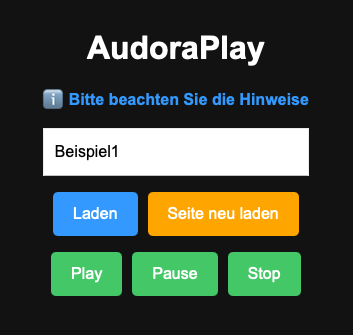

# AudoraPlay

_AudoraPlay_ ist eine minimale Distributionslösung für Audiodateien an einen geschlossenen Nutzerkreis. Die Nutzer müssen eine individuelle Kennung eingeben, um an die für Sie bestimmte Audiodatei zu gelangen und diese abzuspielen. Die Kennung muss den Nutzern vorher mitgeteilt werden, z.B. per E-Mail. _AudoraPlay_ hat einen eigenständigen Audio-Player.

Die Nutzerkennung entspricht dem Dateinamen der Audiodatei. Das Durchsuchen des Speicherorts für die Audiodateien ist für die Nutzer nicht möglich. 

_AudoraPlay_ nutzt einen git-basierten Workflow. 

_AudoraPlay_ benötigt keine Cookies, kein Login, keine Registrierung und unterstützt kein Tracking. 

#### Demo

https://audoraplay.knoepffler.net

## Voraussetzungen

- Github-Konto
- OPTIONAL: Netlify-Konto (o.ä.)
- installiertes Git auf lokalem Computer
- Alternativ: klassisches Webhosting

## Installation & Hosting

_AudoraPlay_ nutzt einen git-basierten Workflow. Die Dateien werden in den Verzeichnis `public/audio` abgelegt und anschließend das Shellscript 'update.sh' ausgeführt. Alternativ können natürlich die entsprechenden Git-Befehle manuell ausgeführt werden.

Die Bereitstellung der Dateien sollte über ein privates Repository erfolgen. Die Bereitstellung und den Zugriff auf die Website ermöglicht ein weiterer erforderlicher Dienst, z.B. Netlify, o.ä..

Alternativ kann auch ein klassisches Webhosting verwendet werden, dann müssen die Dateien mit einem FTP-Client verwaltet werden.

### Repository clonen

TODO

    $ git clone https....

### Eigenes privates Repo erstellen

TODO

    $ ...

### Bereitstellung über Netlify einrichten

TODO ...

### HTTPS-Verschlüsselung einrichten

TODO ...

## Nutzung von _AudoraPlay_

Die Bereitstellung der Audiodateien erfolgt über einen git-basierten Workflow. Die Audiodatei/en sind im Verzeichnis _audio_ abzulegen. In der 'player.js'-Datei kann unter 'extensions' das zu verwendende Dateiformat eingestellt werden. Die korrekte Extension wird automatisch ermittelt.

**Beispiel**

Die Nutzer geben dann als Kennung lediglich 'Beispiel1' oder 'Beispiel2' ein und erhalten dann die Audiodatei zum Abspielen.

Nach dem Hinzufügen und Ausführen des 'update.sh'-Scripts wird durch Netlify (o.ä.) die Aktualisierung bereitgestellt. Über die URL kann nun auf die Startseite zugegriffen werden. Die Eingabe von 'Beispiel1' oder 'Beispiel2' ermöglicht die Wiedergabe der Audiodatei.

## Weitere Schritte

Es ist zu prüfen, ob eine Impressums und/oder Datenschutzerklärung erforderlich ist. Bei Bedarf können die enthaltenen Vorlagen angepasst und verwendet werden.

Das Styling der Website kannn durch Hinzufügen oder Anpassungen in der public/src/css/style.css vorgenommen werden.

## Lizenz-Informationen

Die Bereitstellung von _AudoraPlay_ erfolgt auf der MIT Open Source Lizenz.

## AudoraPlay nutzt Open Source

UNPKG (css reset)
https://unpkg.com

##  Made with AI

ChatGPT
https://chatgpt.com
